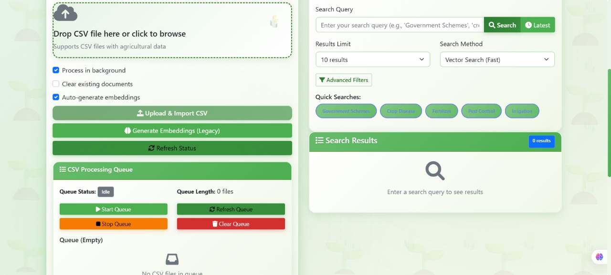

# 🌱 Kishan Call VectorDB - Feature Documentation

## 📸 User Interface Gallery

### Main Dashboard

The main dashboard showcases our farming-themed design with:

- Clean, organized layout with green color scheme
- Real-time system statistics and health monitoring
- Quick access to all major features
- Beautiful agricultural-inspired visual elements

### Smart Search Interface

Our intelligent search system features:

- Real-time search with latest data preview
- Advanced filtering options
- Similarity scores and relevance indicators
- Mobile-responsive design

### Background Processing Manager

Comprehensive background processing control:

- Real-time progress monitoring
- Queue management with visual status
- Configurable processing parameters
- Detailed logging and error tracking

### Data Management System

Advanced data management capabilities:

- Drag & drop CSV upload interface
- Processing options and configurations
- Real-time upload progress tracking
- Queue status and file management

---

## Core Features Overview

### 🎨 Farming-Themed UI

- **Green Design Language**: Beautiful farming-inspired color palette using various shades of green
- **Agricultural Icons**: Farming-themed icons and emojis throughout the interface
- **Responsive Layout**: Mobile-first design that works on all devices
- **Nature Gradients**: Smooth gradient transitions representing agricultural growth

### 🔍 Smart Search System

#### Real-time Search Behavior

1. **Empty Query**: Welcome message with instructions
2. **1-2 Characters**: Shows latest agricultural data (500ms delay)
3. **3+ Characters**: Performs semantic search (800ms delay)
4. **Enter Key**: Immediate search execution

#### Search Methods

- **Vector Search**: MongoDB Atlas vector search for fast, accurate results
- **Fallback Search**: Manual cosine similarity when vector search is unavailable
- **Latest Data**: Chronologically sorted newest agricultural content

#### Search Features

- **Similarity Scores**: Percentage-based relevance indicators
- **Advanced Filters**: State, Category, and custom field filtering
- **Result Limits**: Configurable result counts (5, 10, 20, 50)
- **Query Caching**: Embedding cache for repeated searches

### 📊 Data Management

#### CSV Upload & Processing

- **Drag & Drop**: Intuitive file upload interface
- **Background Processing**: Queue-based processing for large files
- **Real-time Progress**: Live upload and processing status
- **Error Handling**: Comprehensive error reporting and recovery

#### Data Storage

- **MongoDB Atlas**: Scalable cloud database storage
- **Vector Embeddings**: 384-dimensional embeddings using Xenova transformers
- **Metadata Preservation**: Complete agricultural data field retention
- **Timestamp Tracking**: Creation and modification timestamps

### ⚙️ Background Processing

#### Embedding Generation

- **Batch Processing**: Configurable batch sizes for optimal performance
- **Progress Monitoring**: Real-time progress bars and statistics
- **Error Recovery**: Automatic retry with configurable attempts
- **Resource Management**: Memory-efficient processing

#### CSV Queue Management

- **Multi-file Support**: Process multiple CSV files sequentially
- **Queue Controls**: Start, stop, pause, and resume operations
- **Status Tracking**: Individual file processing status
- **Queue Visualization**: Real-time queue status display

### 📈 Monitoring & Analytics

#### Real-time Status

- **Document Counts**: Live database statistics
- **Processing Progress**: Current operation status
- **System Health**: Connection and service status
- **Performance Metrics**: Search timing and throughput

#### Logging System

- **Detailed Logs**: Comprehensive operation logging
- **Log Levels**: Info, Warning, Error, Success categories
- **Timestamp Tracking**: Precise operation timing
- **Log Management**: Auto-cleanup and size management

## Advanced Features

### 🚀 Performance Optimizations

- **Query Caching**: Embedding cache for faster repeated searches
- **Batch Processing**: Efficient bulk operations
- **Connection Pooling**: Optimized database connections
- **Memory Management**: Efficient resource utilization

### 🔒 Error Handling

- **Graceful Degradation**: Fallback mechanisms for failed operations
- **Retry Logic**: Automatic retry with exponential backoff
- **User Feedback**: Clear error messages and recovery suggestions
- **System Recovery**: Automatic system recovery mechanisms

### 🌐 API Architecture

- **RESTful Design**: Standard HTTP methods and status codes
- **JSON Responses**: Consistent response formatting
- **Error Standardization**: Uniform error response structure
- **Documentation**: Comprehensive API documentation

## User Experience Features

### 🎯 Intuitive Interface

- **Visual Hierarchy**: Clear information architecture
- **Loading States**: Smooth loading animations and progress indicators
- **Interactive Elements**: Hover effects and smooth transitions
- **Accessibility**: Keyboard navigation and screen reader support

### 📱 Mobile Experience

- **Touch Optimization**: Mobile-friendly touch targets
- **Responsive Images**: Optimized images for different screen sizes
- **Mobile Navigation**: Simplified navigation for mobile devices
- **Performance**: Fast loading on mobile networks

### 🎨 Visual Design

- **Color Psychology**: Green colors representing growth and agriculture
- **Typography**: Clear, readable fonts suitable for all users
- **Icons**: Contextual icons improving user understanding
- **Animations**: Subtle animations enhancing user experience

## Technical Features

### 🛠️ Development Tools

- **Hot Reload**: Automatic server restart during development
- **Environment Configuration**: Flexible environment variable management
- **Code Organization**: Modular architecture for maintainability
- **Error Debugging**: Comprehensive error logging and debugging

### 🔧 Configuration Options

- **Batch Sizes**: Configurable processing batch sizes
- **Timing Controls**: Adjustable delays and timeouts
- **Search Parameters**: Customizable search behavior
- **UI Settings**: Themeable interface components

### 📦 Deployment Ready

- **Production Build**: Optimized production configuration
- **Environment Support**: Development, staging, and production environments
- **Monitoring Hooks**: Built-in monitoring and health checks
- **Scalability**: Designed for horizontal scaling

## Future Enhancements

### 🌟 Planned Features

- **Multi-language Support**: Regional language support for farmers
- **Advanced Analytics**: Trend analysis and insights
- **Mobile Application**: Native mobile app development
- **AI Recommendations**: Smart farming recommendations
- **Weather Integration**: Weather-based query suggestions
- **Export Features**: Data export in multiple formats

### 🔮 Vision

- **Community Platform**: Farmer community features
- **Expert Integration**: Agricultural expert consultation
- **IoT Integration**: Farm sensor data integration
- **Predictive Analytics**: Crop yield and disease prediction
- **Marketplace**: Agricultural product marketplace
- **Educational Content**: Farming tutorials and guides
