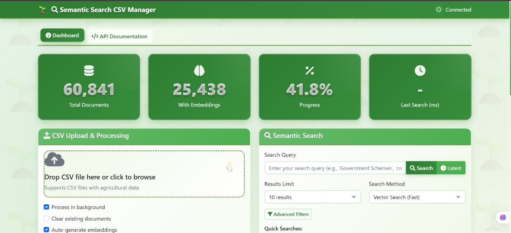
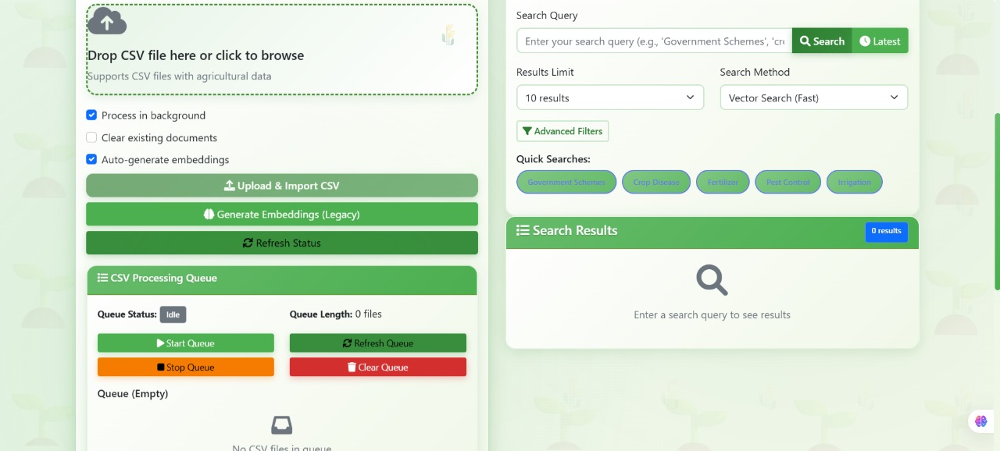
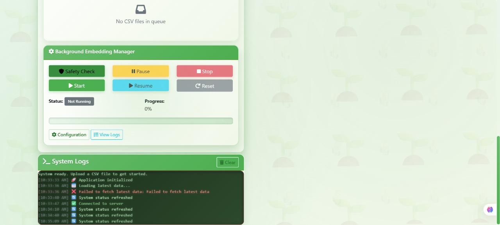
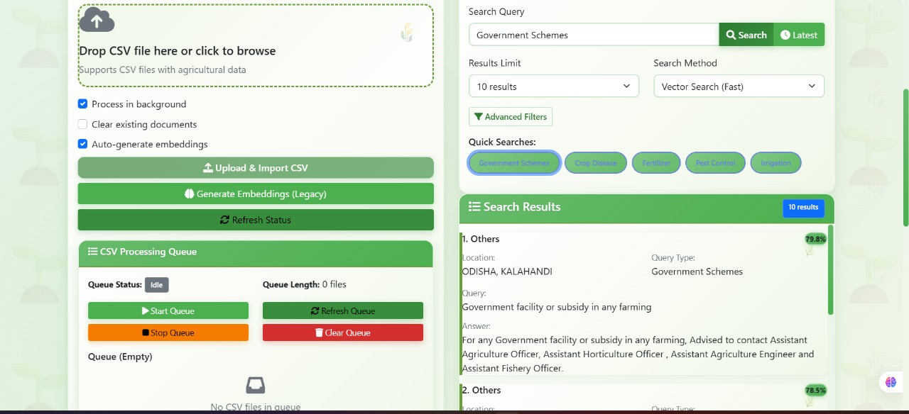

# 🌱 Kishan Call - Farming-Themed Semantic Search Platform

A comprehensive Express.js server with MongoDB Atlas integration, featuring semantic search capabilities, background processing, and a beautiful farming-themed UI for agricultural data management.

## 📸 UI Screenshots

### 🌿 Farming-Themed Interface

Our beautiful green-themed interface designed specifically for the agricultural community:


_Main Dashboard - Overview of the semantic search platform with farming theme_


_Smart Search Interface - Real-time search with latest data display_


_Background Processing Manager - Queue management and embedding generation_


_Data Management - CSV upload and processing with real-time status_

---

## 🚀 Features

### Core Features

- ✅ **MongoDB Atlas Integration** - Robust database connectivity with error handling
- ✅ **Semantic Search** - Advanced vector search using local Xenova transformers
- ✅ **CSV Data Management** - Upload and process agricultural CSV data
- ✅ **Background Processing** - Queue-based CSV processing and embedding generation
- ✅ **Real-time Updates** - Live status monitoring and progress tracking
- ✅ **Farming Theme UI** - Beautiful green-themed interface with farming elements

### Advanced Features

- ✅ **Latest Data Display** - Shows newest agricultural data when users start searching
- ✅ **Background Embedding Generation** - Automated, configurable embedding processing
- ✅ **CSV Queue Management** - Multi-file processing with status tracking
- ✅ **Vector Search Optimization** - Fast MongoDB Atlas vector search with fallback
- ✅ **Real-time Search** - Auto-search as users type with smart delays
- ✅ **Comprehensive API** - RESTful endpoints for all operations

### User Experience

- 🌾 **Intuitive Interface** - Farming-themed design with green gradients
- 📱 **Responsive Design** - Works seamlessly on all devices
- 🔍 **Smart Search** - Shows latest data for short queries, performs semantic search for longer ones
- 📊 **Live Statistics** - Real-time document counts and processing status
- 📝 **Activity Logs** - Detailed operation logs with timestamps

## 🛠️ Setup

### 1. Install Dependencies

```bash
npm install
```

### 2. Environment Configuration

Create a `.env` file in the root directory:

```env
# MongoDB Connection
MONGODB_URI=your_mongodb_atlas_connection_string

# Server Configuration
PORT=5000
NODE_ENV=development

# Optional: OpenAI API Key (for future enhancements)
OPENAI_API_KEY=your_openai_api_key
```

### 3. MongoDB Atlas Vector Index Setup

Create a vector search index named `vector_index` in your MongoDB Atlas collection:

```json
{
  "fields": [
    {
      "type": "vector",
      "path": "embedding",
      "numDimensions": 384,
      "similarity": "cosine"
    }
  ]
}
```

**Note:** We use 384 dimensions for the Xenova/all-MiniLM-L6-v2 model.

### 4. Start the Server

```bash
# Production mode
npm start

# Development mode with auto-reload
npm run dev
```

Visit `http://localhost:5000` to access the web interface.

## 📋 API Documentation

### Core Endpoints

#### Health Check

```http
GET /
```

Returns server status and available endpoints.

#### System Status

```http
GET /api/status
```

Returns database statistics and system health.

### Data Management

#### Upload CSV

```http
POST /api/upload-csv
Content-Type: multipart/form-data

{
  "csvFile": <file>,
  "processInBackground": true,
  "clearExisting": false,
  "generateEmbeddings": true
}
```

#### Get Latest Data

```http
GET /api/latest-data?limit=10&filters={"StateName":"Punjab"}
```

Returns the newest agricultural data sorted by creation date.

### Search Operations

#### Semantic Search

```http
POST /api/search
Content-Type: application/json

{
  "query": "rice farming techniques",
  "topK": 10,
  "filters": {
    "StateName": "Punjab",
    "Category": "Crop Management"
  }
}
```

#### Fallback Search

```http
POST /api/search-fallback
Content-Type: application/json

{
  "query": "wheat disease management",
  "topK": 10,
  "filters": {}
}
```

### Background Processing

#### Background Embeddings

```http
# Start background embedding generation
POST /api/background-embeddings/start
{
  "batchSize": 50,
  "delayBetweenBatches": 1000,
  "retryAttempts": 3,
  "priority": "normal"
}

# Get status
GET /api/background-embeddings/status?detailed=true

# Control operations
POST /api/background-embeddings/pause
POST /api/background-embeddings/resume
POST /api/background-embeddings/stop

# View logs
GET /api/background-embeddings/logs?level=info&limit=100
```

#### CSV Queue Management

```http
# Get queue status
GET /api/csv-queue/status

# Control queue
POST /api/csv-queue/start
POST /api/csv-queue/stop
POST /api/csv-queue/clear
```

## 🗄️ Database Schema

### Document Collection Structure

```javascript
{
  _id: ObjectId,
  StateName: String,           // State name (e.g., "Punjab")
  DistrictName: String,        // District name
  BlockName: String,           // Block name
  Season: String,              // Agricultural season
  Sector: String,              // Sector information
  Category: String,            // Query category
  Crop: String,                // Crop type
  QueryType: String,           // Type of query
  QueryText: String,           // User's question
  KccAns: String,              // KCC's answer
  CreatedOn: Date,             // Creation timestamp
  year: Number,                // Year
  month: Number,               // Month
  embedding: [Number]          // 384-dimensional vector embedding
}
```

## 🎨 UI Features

### Farming Theme Elements

- 🌱 **Green Color Palette** - Various shades of green representing agriculture
- 🌾 **Agricultural Icons** - Farming-themed icons and emojis
- 🌿 **Nature Gradients** - Smooth green gradients throughout the interface
- 📱 **Responsive Design** - Mobile-friendly farming theme

### Smart Search Behavior

1. **Empty Query** - Shows welcome message
2. **1-2 Characters** - Displays latest agricultural data (500ms delay)
3. **3+ Characters** - Performs semantic search (800ms delay)
4. **Real-time Results** - Updates as user types

### Visual Indicators

- **Latest Data** - Green badges and special styling (see image1002.jpg)
- **Search Results** - Similarity scores and relevance indicators
- **Processing Status** - Live progress bars and status indicators (see image1003.jpg)
- **Queue Management** - Real-time queue status and file processing (see image1004.jpg)

### Interface Highlights

- **Dashboard Overview** - Clean, organized layout with farming aesthetics (image1001.jpg)
- **Interactive Elements** - Hover effects, smooth transitions, and farming-inspired animations
- **Status Monitoring** - Real-time system health and processing status displays
- **Data Visualization** - Beautiful charts and progress indicators with green theme

## ⚙️ Configuration Options

### Background Embedding Settings

- **Batch Size** - Number of documents processed per batch (default: 50)
- **Delay Between Batches** - Milliseconds between batches (default: 1000)
- **Retry Attempts** - Number of retry attempts for failed documents (default: 3)
- **Priority Levels** - normal, high, low processing priorities

### Search Configuration

- **Results Limit** - 5, 10, 20, or 50 results
- **Search Methods** - Vector search with fallback support
- **Filters** - State, Category, and other field filters
- **Real-time Delays** - Configurable typing delays

## 🔧 Advanced Features

### Background Processing

- **Queue-based System** - Multiple CSV files processed sequentially
- **Progress Tracking** - Real-time progress monitoring
- **Error Handling** - Comprehensive error tracking and retry logic
- **Resource Management** - Memory-efficient batch processing

### Search Optimization

- **Query Caching** - Embedding cache for repeated queries
- **Fallback Support** - Manual cosine similarity when vector search fails
- **Smart Filtering** - Multiple filter combinations
- **Result Ranking** - Similarity-based result ordering

### Monitoring & Logging

- **Real-time Status** - Live system health monitoring
- **Detailed Logs** - Comprehensive operation logging
- **Performance Metrics** - Search timing and processing statistics
- **Error Tracking** - Detailed error reporting and handling

## 🚀 Getting Started Guide

### For Developers

1. **Clone and Setup**

   ```bash
   git clone <repository-url>
   cd kishancall
   npm install
   ```

2. **Configure Environment**

   - Set up MongoDB Atlas cluster
   - Create vector search index
   - Configure environment variables

3. **Import Sample Data**

   - Use the web interface to upload CSV files
   - Enable background processing for large files

4. **Generate Embeddings**
   - Start background embedding generation
   - Monitor progress through the web interface

### For Users

1. **Upload Data** - Use the farming-themed interface to upload CSV files (see UI screenshots above)
2. **Search Content** - Start typing to see latest data, or search with keywords
3. **Monitor Progress** - Watch real-time processing status through the beautiful dashboard
4. **Manage Queue** - Control CSV processing queue as needed

> 💡 **Tip:** Check out the UI screenshots above to see the beautiful farming-themed interface in action!

## 🌱 Future Enhancements

- **Advanced Analytics** - Farming trend analysis and insights
- **Multi-language Support** - Support for regional languages
- **Mobile App** - Native mobile application
- **AI Recommendations** - Smart farming recommendations
- **Weather Integration** - Weather-based query suggestions
- **Export Features** - Data export in various formats

## 🤝 Contributing

1. Fork the repository
2. Create a feature branch (`git checkout -b feature/amazing-feature`)
3. Commit your changes (`git commit -m 'Add amazing feature'`)
4. Push to the branch (`git push origin feature/amazing-feature`)
5. Open a Pull Request

## 📜 License

This project is licensed under the MIT License - see the [LICENSE](LICENSE) file for details.

## 🙏 Acknowledgments

- **Xenova Transformers** - For local embedding generation
- **MongoDB Atlas** - For vector search capabilities
- **Bootstrap** - For responsive UI components
- **Font Awesome** - For beautiful icons

---

**🌾 Happy Farming! 🌾**

_Built with ❤️ for the agricultural community_
